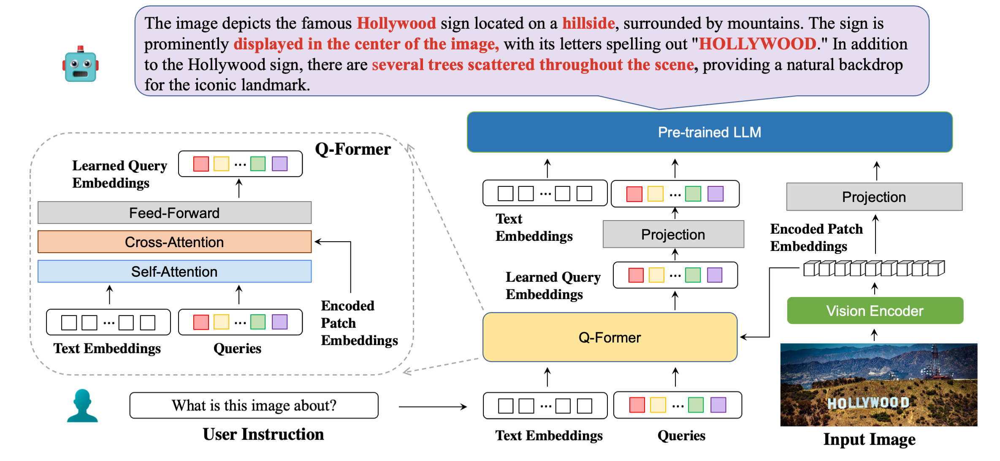

# BLIVA: A Simple Multimodal LLM for Better Handling of Text-rich Visual Questions
[Wenbo Hu*](https://gordonhu608.github.io/), [Yifan Xu*](https://yfxu.com/), [Yi Li](https://jerryli1019.github.io/), [Weiyue Li](https://weiyueli7.github.io/), [Zeyuan Chen](https://zeyuan-chen.com/), and [Zhuowen Tu](https://pages.ucsd.edu/~ztu/). *Equal Contribution

**UC San Diego**, **Coinbase Global, Inc.**

<a href='https://ojs.aaai.org/index.php/AAAI/article/view/27999'></a>  <a href='https://gordonhu608.github.io/bliva/'></a>  <a href='https://arxiv.org/abs/2308.09936'></a> <a href='https://huggingface.co/spaces/mlpc-lab/BLIVA'></a> <a href='https://huggingface.co/mlpc-lab/BLIVA_Vicuna'></a> <a href='https://huggingface.co/mlpc-lab/BLIVA_FlanT5'></a> <a href='https://huggingface.co/datasets/mlpc-lab/YTTB-VQA'></a> <a href='docs/BLIVA Demo.pdf'></a> 


<p align="center">
    <a href="https://huggingface.co/spaces/mlpc-lab/BLIVA"></a> <br> Our model architecture in detail with example responses.
</p>

## Release
- [12/08] 🔥 BLIVA is accepted by AAAI 2024.
- [9/13] 🔥 We released the training code of BLIVA. 
- [9/06] 🔥 We released a [Demo Slides](docs/BLIVA%20Demo.pdf) for researchers and related workers to learn about BLIVA's abilities and use cases efficiently. 
- [8/28] 🔥 Our model achieved **No.3** in Perception tasks and **No.2** in Cognition tasks on the [MME benchmark](https://github.com/BradyFU/Awesome-Multimodal-Large-Language-Models/tree/Evaluation), improving 6 positions than our baseline in Perception tasks and 5 positions in Cognition tasks. BLIVA achieved **No.1 in Color, Poster, and Commonsense Reasoning subtasks**. 
- [8/21] 🔥 We released **BLIVA: A Simple Multimodal LLM for Better Handling of Text-Rich Visual Questions**.  Checkout the [paper](https://arxiv.org/abs/2308.09936). 
- [8/21] We released our demo at [here](https://huggingface.co/spaces/mlpc-lab/BLIVA) which is publicly available for everyone to play with. If the huggingface space instance is stopped, feel free to relaunch it. The wait time is around 30s.
- [8/21] We released our Model weight for BLIVA Vicuna Version at [here](https://huggingface.co/mlpc-lab/BLIVA_Vicuna) and FLAN T5 Version at [here](https://huggingface.co/mlpc-lab/BLIVA_FlanT5) which is available for commercial use. 
- [8/21] Our Youtube Visual Question Answering Dataset (YTTB-VQA) is available at [here](https://huggingface.co/datasets/mlpc-lab/YTTB-VQA).

### Performance on Text-Rich VQA Benchmarks
<table>
<thead>
  <tr>
    <th>Method</th>
    <th>STVQA</th>
    <th>OCRVQA</th>
    <th>TextVQA</th>
    <th>DocVQA</th>
    <th>InfoVQA</th>
    <th>ChartQA</th>
    <th>ESTVQA</th>
    <th>FUNSD</th>
    <th>SROIE</th>
    <th>POIE</th>
    <th>Average</th>
  </tr>
</thead>
<tbody>
  <tr>
    <td>OpenFlamingo</td>
    <td>19.32</td>
    <td>27.82</td>
    <td>29.08</td>
    <td>5.05</td>
    <td>14.99</td>
    <td>9.12</td>
    <td>28.20</td>
    <td>0.85</td>
    <td>0.12</td>
    <td>2.12</td>
    <td>13.67</td>
  </tr>
  <tr>
    <td>BLIP2-OPT</td>
    <td>13.36</td>
    <td>10.58</td>
    <td>21.18</td>
    <td>0.82</td>
    <td>8.82</td>
    <td>7.44</td>
    <td>27.02</td>
    <td>0.00</td>
    <td>0.00</td>
    <td>0.02</td>
    <td>8.92</td>
  </tr>
  <tr>
    <td>BLIP2-FLanT5XXL</td>
    <td>21.38</td>
    <td>30.28</td>
    <td>30.62</td>
    <td>4.00</td>
    <td>10.17</td>
    <td>7.20</td>
    <td>42.46</td>
    <td>1.19</td>
    <td>0.20</td>
    <td>2.52</td>
    <td>15.00</td>
  </tr>
  <tr>
    <td>MiniGPT4</td>
    <td>14.02</td>
    <td>11.52</td>
    <td>18.72</td>
    <td>2.97</td>
    <td>13.32</td>
    <td>4.32</td>
    <td>28.36</td>
    <td>1.19</td>
    <td>0.04</td>
    <td>1.31</td>
    <td>9.58</td>
  </tr>
  <tr>
    <td>LLaVA</td>
    <td>22.93</td>
    <td>15.02</td>
    <td>28.30</td>
    <td>4.40</td>
    <td>13.78</td>
    <td>7.28</td>
    <td>33.48</td>
    <td>1.02</td>
    <td>0.12</td>
    <td>2.09</td>
    <td>12.84</td>
  </tr>
    <tr>
    <td>mPLUG-Owl</td>
    <td>26.32</td>
    <td>35.00</td>
    <td>37.44</td>
    <td>6.17</td>
    <td><b>16.46</b></td>
    <td><b>9.52</b></td>
    <td><b>49.68</b></td>
    <td>1.02</td>
    <td>0.64</td>
    <td><b>3.26</b></td>
    <td>18.56</td>
  </tr>
    <tr>
    <td>InstructBLIP (FLANT5XXL)</td>
    <td>26.22</td>
    <td>55.04</td>
    <td>36.86</td>
    <td>4.94</td>
    <td>10.14</td>
    <td>8.16</td>
    <td>43.84</td>
    <td>1.36</td>
    <td>0.50</td>
    <td>1.91</td>
    <td>18.90</td>
  </tr>
    <tr>
    <td>InstructBLIP (Vicuna-7B)</td>
    <td>28.64</td>
    <td>47.62</td>
    <td>39.60</td>
    <td>5.89</td>
    <td>13.10</td>
    <td>5.52</td>
    <td>47.66</td>
    <td>0.85</td>
    <td>0.64</td>
    <td>2.66</td>
    <td>19.22</td>
  </tr>
    <tr>
    <td>BLIVA (FLANT5XXL)</td>
    <td>28.24</td>
    <td>61.34</td>
    <td>39.36</td>
    <td>5.22</td>
    <td>10.82</td>
    <td>9.28</td>
    <td>45.66</td>
    <td><b>1.53</b></td>
    <td>0.50</td>
    <td>2.39</td>
    <td>20.43</td>
  </tr>
    <tr>
    <td>BLIVA (Vicuna-7B)</td>
    <td><b>29.08</b></td>
    <td><b>65.38</b></td>
    <td><b>42.18</b></td>
    <td><b>6.24</b></td>
    <td>13.50</td>
    <td>8.16</td>
    <td>48.14</td>
    <td>1.02</td>
    <td><b>0.88</b></td>
    <td>2.91</td>
    <td><b>21.75</b></td>
  </tr>
</tbody>
</table>

### Performance on General (not particularly text-rich) VQA Benchmarks
<table>
    <tr>
        <th>Method</th>
        <th>VSR</th>
        <th>IconQA</th>
        <th>TextVQA</th>
        <th>Visdial</th>
        <th>Flickr30K</th>
        <th>HM</th>
        <th>VizWiz</th>
        <th>MSRVTT</th>
    </tr>
    <tr>
        <td>Flamingo-3B</td>
        <td>-</td>
        <td>-</td>
        <td>30.1</td>
        <td>-</td>
        <td>60.6</td>
        <td>-</td>
        <td>-</td>
        <td>-</td>
    </tr>
    <tr>
        <td>Flamingo-9B</td>
        <td>-</td>
        <td>-</td>
        <td>31.8</td>
        <td>-</td>
        <td>61.5</td>
        <td>-</td>
        <td>-</td>
        <td>-</td>
    </tr>
    <tr>
        <td>Flamingo-80B</td>
        <td>-</td>
        <td>-</td>
        <td>35.0</td>
        <td>-</td>
        <td>67.2</td>
        <td>-</td>
        <td>-</td>
        <td>-</td>
    </tr>
    <tr>
        <td>MiniGPT-4</td>
        <td>50.65</td>
        <td>-</td>
        <td>18.56</td>
        <td>-</td>
        <td>-</td>
        <td>29.0</td>
        <td>34.78</td>
        <td>-</td>
    </tr>
    <tr>
        <td>LLaVA</td>
        <td>56.3</td>
        <td>-</td>
        <td>37.98</td>
        <td>-</td>
        <td>-</td>
        <td>9.2</td>
        <td>36.74</td>
        <td>-</td>
    </tr>
    <tr>
        <td>BLIP-2 (Vicuna-7B)</td>
        <td>50.0</td>
        <td>39.7</td>
        <td>40.1</td>
        <td>44.9</td>
        <td>74.9</td>
        <td>50.2</td>
        <td><b>49.34</b></td>
        <td>4.17</td>
    </tr>
    <tr>
        <td>InstructBLIP (Vicuna-7B)</td>
        <td>54.3</td>
        <td>43.1</td>
        <td>50.1</td>
        <td>45.2</td>
        <td>82.4</td>
        <td>54.8</td>
        <td>43.3</td>
        <td>18.7</td>
    </tr>
    <tr>
        <td>BLIVA (Vicuna-7B)</td>
        <td><b>62.2</b></td>
        <td><b>44.88</b></td>
        <td><b>57.96</b></td>
        <td><b>45.63</b></td>
        <td><b>87.1</b></td>
        <td><b>55.6</b></td>
        <td>42.9</td>
        <td><b>23.81</b></td>
    </tr>
</table>

## Installation

1. Creating conda environment

```bash
conda create -n bliva python=3.9
conda activate bliva
```

2. build from source

```bash
git clone https://github.com/mlpc-ucsd/BLIVA
cd BLIVA
pip install -e .
```

## Prepare Weight

1. BLIVA Vicuna 7B

    Our Vicuna version model is released at [here](https://huggingface.co/mlpc-lab/BLIVA_Vicuna). Download our model weight and specify the path in the model config [here](bliva/configs/models/bliva_vicuna7b.yaml#L8) at line 8. 

    The LLM we used is the v0.1 version from Vicuna-7B. To prepare Vicuna's weight, please refer to our instruction [here](PrepareVicuna.md). Then, set the path to the vicuna weight in the model config file [here](bliva/configs/models/bliva_vicuna7b.yaml#L21) at Line 21.

2. BLIVA FlanT5 XXL (Available for Commercial Use)

    The FlanT5 version model is released at [here](https://huggingface.co/mlpc-lab/BLIVA_FlanT5). Download our model weight and specify the path in the model config [here](bliva/configs/models/bliva_flant5xxl.yaml#L8) at line 8. 

    The LLM weight for Flant5 will automatically begin to download from huggingface when running our inference code. 

## Inference 

To answer one question from the image, run the following evaluation code. For example,

```Shell
python evaluate.py --answer_qs \
        --model_name bliva_vicuna \
        --img_path images/example.jpg \
        --question "what is this image about?"
```

We also support answer multiple choice question, which is the same as we used for evaluation tasks in paper. To provide a list of chioce, it should be a string split by comma. For example,

```Shell
python evaluate.py --answer_mc \
        --model_name bliva_vicuna \
        --img_path images/mi6.png \
        --question "Which genre does this image belong to?" \
        --candidates "play, tv show, movie"
```
## Demo

Our Demo is publicly available at [here](https://huggingface.co/spaces/mlpc-lab/BLIVA). To run our demo locally on your machine. Run:

```Shell
python demo.py
```

## Train

After downloading the training datasets and specify their path in [dataset configs](bliva/configs/datasets/), we are ready for training. We utilized 8x A6000 Ada in our experiments. Please adjust hyperparamters according to your GPU resources. It may take transformers around 2 minutes to load the model, give some time for the model to start training. Here we give an example of traning BLIVA Vicuna version, the Flant5 version follows the same format.

1. Pretraining of BLIVA's visual assistant branch 

```Shell
torchrun --nnodes=1 --nproc_per_node=8 \
    train.py \
    --cfg-path train_configs/pretrain_bliva_vicuna.yaml
```

2. Instruction Finetuning BLIVA

```Shell
torchrun --nnodes=1 --nproc_per_node=8 \
    train.py \
    --cfg-path train_configs/finetune_bliva_vicuna.yaml
```

Or, we also support training Vicuna7b together with BLIVA using LoRA during the second step, by default we don't use this version. 

```Shell
torchrun --nnodes=1 --nproc_per_node=8 \
    train.py \
    --cfg-path train_configs/finetune_bliva_and_vicuna.yaml
```


## Citation

If you find BLIVA useful for your research and applications, please cite using this BibTeX:
```bibtex
@misc{hu2023bliva,
      title={BLIVA: A Simple Multimodal LLM for Better Handling of Text-Rich Visual Questions}, 
      author={Wenbo Hu and Yifan Xu and Yi Li and Weiyue Li and Zeyuan Chen and Zhuowen Tu},
      publisher={arXiv:2308.09936},
      year={2023},
}
```

## Acknowledgement
- [BLIP2](https://huggingface.co/docs/transformers/main/model_doc/blip-2) The model architecture of BLIVA follows BLIP-2. Don't forget to check this great open-source work if you don't know it before. 
- [Lavis](https://github.com/salesforce/LAVIS) The codebase we built upon.
- [Vicuna](https://github.com/lm-sys/FastChat) Vicuna-13B demonstrates fantastic language ability and it's open source. 
- [MultimodalOCR](https://github.com/Yuliang-Liu/MultimodalOCR) A great Mulimodality OCR evaluation pipeline that we followed. 
- [MME](https://github.com/BradyFU/Awesome-Multimodal-Large-Language-Models/tree/Evaluation) A comprehensive evaluation benchmark for multimodal large language models that we tested our model on. 

## License
This repository's code is under [BSD 3-Clause License](LICENSE.md).
Many codes are based on [Lavis](https://github.com/salesforce/LAVIS) with 
BSD 3-Clause License [here](LICENSE_LAVIS.md).

For our model parameters of BLIVA Vicuna Version, it's should be used under LLaMA's [model license](https://github.com/facebookresearch/llama/blob/llama_v1/LICENSE). 
For the model weight of BLIVA FlanT5, it's under [Apache 2.0 License](LICENSE_BLIVA_FLANT5_WEIGHT.md). 
For our YTTB-VQA data, it's under [CC BY NC 4.0](LICENSE_DATA.md)

[](LICENSE.md)
[](https://github.com/facebookresearch/llama/blob/llama_v1/LICENSE)
[](LICENSE_BLIVA_FLANT5_WEIGHT.md)
[](LICENSE_DATA.md)

